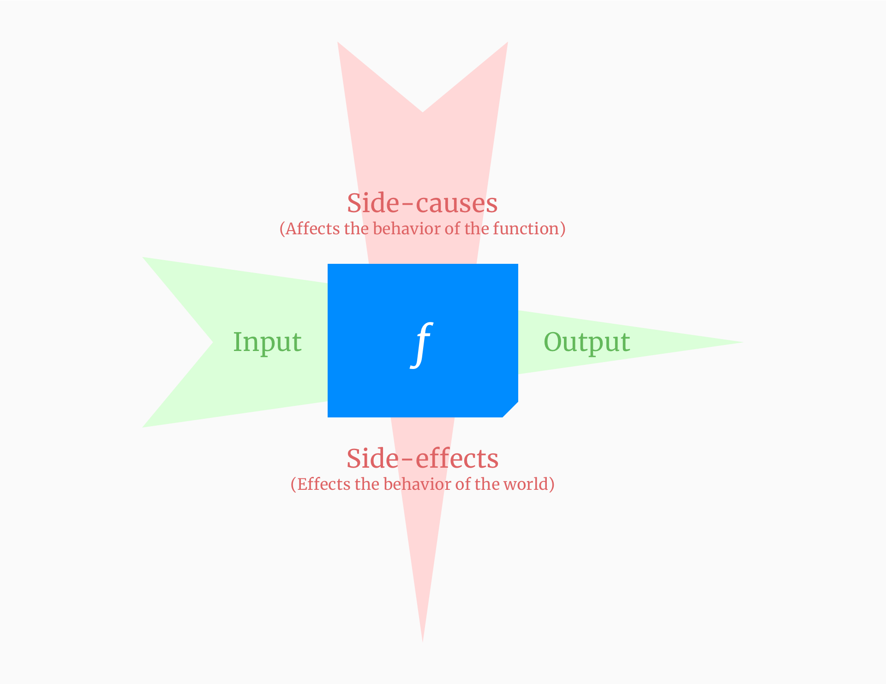
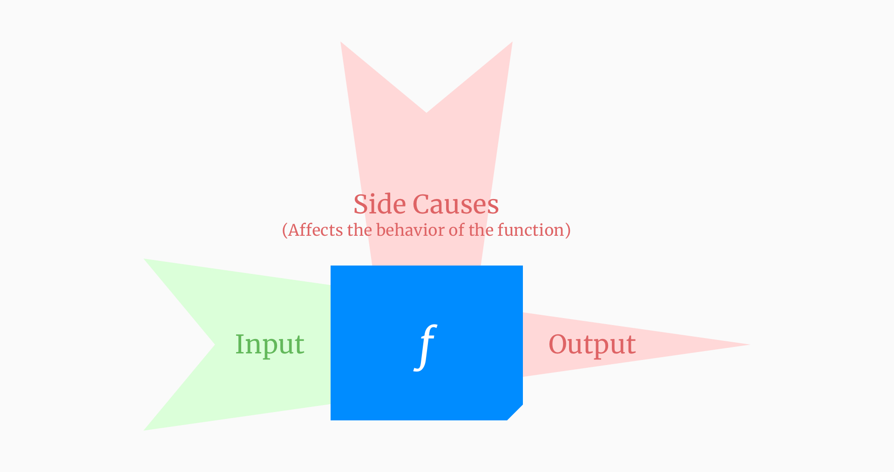
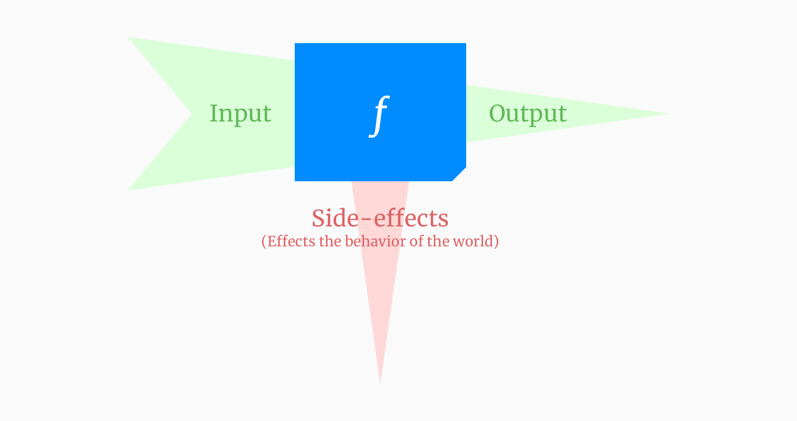
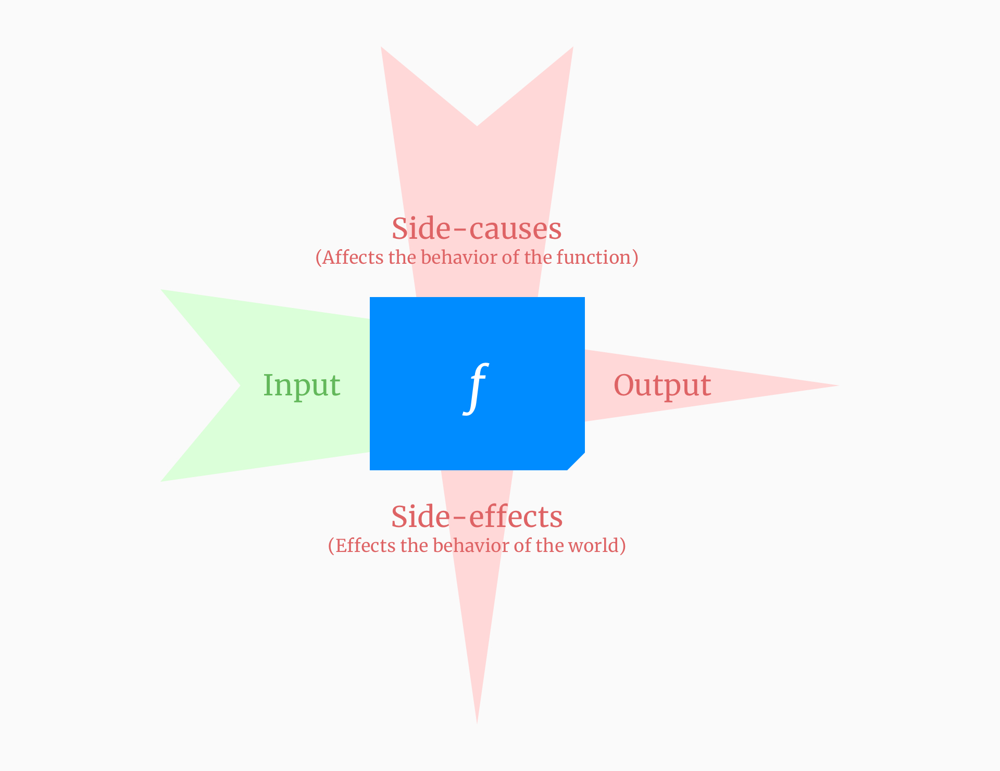

امان از دست کلمات و اصطلاحات قلبمه و سملبه‌ی
functional programming!
هرچند این کلمات یادگیری را دشوار می‌کنند ولی فوائدی هم دارند.

دقت کردید هر کسی از کلمه
femenism
یک تعریف داره؟
بعضی از کلمات قلمبه و سلمبه در
functinal programming
هم دچار همچین عاقبتی شدند.

دلایل مختلفی باعث این موضوع شده و یکی از آنها به نظر من تلاش تولید کننده‌های محتوا برای ساده کردن مفاهیم بوده.
این ساده کردن در بعضی موارد منجر به انتقال ناقص مفهوم و حتی انتقال نادرست آن شده.
یکی از آنها مفهومیه با نام
side-effect.
حدس میزنم که تا به حال حداقل یکبار در این رابطه مطالعه کردید!
با کمال تاسف باید بگم که غالب تعاریف و مطالبی که شما با آنها برخورد کردید کاملا غلط هستند. نه از دید من! بلکه از دید ریاضیات!

اگر علاقه‌مند به دیدن ویدئو هستید توصیه میکنم فانکشنال تراپی زیر را حتما تماشا کنید.

<YouTube videoId="aTzKzJDuLwM" />

---


<LTR>

## Side-effect

</LTR>


اول یک نگاهی به تعریف
Wikipedia
کنیم:


<LTR>

> In computer science, an operation, function or expression is said to have a side effect if it modifies some state variable value(s) outside its local environment, ...
>
> -- [Wikipedia](<https://en.wikipedia.org/wiki/Side_effect_(computer_science)>)

</LTR>

یک مقدار پیچیده شد! ساده‌ترش را ببینیم:

<LTR>

> That is to say has an observable effect besides returning a value (the main effect) to the invoker of the operation.
>
> -- [Wikipedia](<https://en.wikipedia.org/wiki/Side_effect_(computer_science)>)

</LTR>

شاید بد نباشه که به اولین تعریفی که از این کلمه شده هم بپردازیم:

<LTR>

> The term Side effect refers to the modification of the nonlocal environment.
>
> -- [David A. Spuler and et al.](https://citeseerx.ist.psu.edu/viewdoc/download?doi=10.1.1.70.2096&rep=rep1&type=pdf)

</LTR>

نگران نباشید! این تعاریف برای دوستداران منبع ذکر شده.
تمامی تعاریف دارند به یک مفهوم ساده اشاره می‌کنند.
کلمه
side-effect
یعنی شما یک چیزی را در یک جایی از این جهان فاسد تغییر بدید!
به شکلی که تغییر ایجاد شده قابل رویت یا تاثیرگذار باشه!

می‌خواید متوجه بشید که آیا یک عملیات
side-effect
داره یا خیر؟
دو شرط پایین را به خاطر بسپارید.

### اولا: Mutation

جدی عرض میکنم!
شما باید واقعا یک تغییر ایجاد کنید!
بدون تغییر نمی‌تونید ادعای داشتن
side-effect
کنید.

به مثال‌های زیر توجه کنید:

- نوشتن یک فایل روی دیسک
- پاک کردن user
- نوشتن یک بلاگ پست جدید
- آغاز جنگ جهانی سوم
- خودکشی

در هر کدام از موارد فوق شما یک تغییری در جهان اطراف ایجاد کردید، پس اولین شرط لازم به‌وجود آوردن یک
side-effect
یعنی
mutation
را دارید.

### دوما: Observable

به مثال زیر توجه کنید:

```js {4,5,7}
function f() {
  let x = 0

  ++x
  ++x

  x = 1

  return x
}
```

در فانکشن
f
ما سه مرتبه مقدار
x
را تغییر دادیم (mutation)
ولی مقدار
x
در خارج از فانکشن
f
قابل رویت نیست. یعنی تغییرات ایجاد شده هیچ تاثیری در جهان ایجاد نکردند.

حالا دلیل انتخاب کلمه
effect
را درک می کنید.
هر
side-effect
باید تاثیری بر سایر موجودیت‌ها اعمال کنه.

<h2 dir="ltr">Idempotency (A.K.A. Determinism)</h2>

فانکشن
`+`
را در نظر بگیرید. اهمیتی نداره که آن را چندبار صدا کنید یا در چه زمانی از روز صدا کنید.
مادامی که ورودی یکسانی به فانکشن
`+`
بدید خروجی یکسانی خواهید گرفت.

```haskell
2 + 2 = 4

-- 2000 years later

2 + 2 = 4
```

فانکشن
idempotent
یا
deterministic
همواره به ازای یک ورودی یکسان یک خروجی یکسان به ما خواهد داد.

در مقابل آن فانکشن
non-idempotent
یا
non-deterministic
قرار گرفته که
**امکان داره**
به ازای ورودی
**یکسان**
خروجی
**غیر‌یکسان**
به ما بده.

```js
Math.random() // 0.33882779821654285
Math.random() // 0.8528583771665288
Math.random() // 0.76382461906862
```

## رابطه side-effect و idempotency

لازمه که دقت کنید دو مفهوم
side-effect
و
idempotency
هیچ ارتباطی به هم ندارند.
یعنی از روی یکی نمی‌تونیم دیگری را اثبات کنیم.

<div class="Image__Medium">
  
</div>

تصویر بالا تفاوت این دو مفهوم و دلیل عدم ارتباطشان را به شما نشان میده.
چیزی که باعث تاثیر روی رفتار فانکشن ما میشه و
idempotency
را نقض می‌کنه با
side cause
نشان داده شده.
تاثیری که فانشکن ما بر جهان میذاره را با
side-effect
نمایش داده.
پس از شما خواهش میکنم برای این دو مفهوم تفاوت قائل بشید.

بر اساس
idempotency
و
side-effect
می‌تونیم فانکشن‌ها را به چهار دسته تقسیم کنیم:

<div dir="ltr">

|                                          | Side-effect-free | Idempotent |
| ---------------------------------------- | ---------------- | ---------- |
| Pure                                     | ✅               | ✅         |
| Impure - side-effectful                  | ❌               | ✅         |
| Impure - non-idempotent                  | ✅               | ❌         |
| Impure - side-effectful + non-idempotent | ❌               | ❌         |

</div>

<h2 dir="ltr">Pure Function (A.K.A. Referential Transparent)</h2>

<div class="Image__Medium">
  
</div>

فانکشن‌هایی که
idempotent
هستند و
side-effectای
ندارند را
pure
خطاب می‌کنیم.
این فانکشن‌ها مثل فانشکن‌های ریاضی عمل میکنند و برای ما بسیار ارزشمندند.
چرا؟ چون بسیار خوانا هستند، تست کردنشان فوق‌العاده ساده است و امکان نداره که رفتار‌های عجیب و غریب ازشان ببینیم.

<h2 dir="ltr">Impure Function (A.K.A. Referential Opaque)</h2>

<div class="Image__Medium">
  
</div>

اگر فانکشن ما
idempotent
نباشه و/یا
side-effect
داشته باشه جزو
impureها
قرار میگیره.
در عمل ما اهمیتی نمیدیم که چرا یک فانکشن
impure
شده و همه را داخل یک دسته قرار میدیم.
در واقع فانکشن اسم درستی برای اینها نیست و باید با عنوان
procedure
صداشون کنیم.
از
procudure
ها انتظار هرگونه رفتار عجیب و غریب و وحشیانه‌ای را داشته باشید.

<h3 dir="ltr">Non-idempotent + Side-effect-free</h3>

<div class="Image__Medium">
  
</div>

```js
let x = 0

function getX() {
  return x
}

function now() {
  return Date.now()
}

function random() {
  return Math.random()
}
```

اگر فکر میکنید که هر کدام از سه فانکشن بالا
side-effect
دارند باید بهتون بگم که در دام تعاریف نادرست قرار گرفتید.
اولین شرط
side-effect
انجام
mutation
بود.
(اگر این جمله را قبول ندارید یعنی شما تعریف خودتان از
side-effect
را ساختید و با کمال تاسف تعریف شما از
side-effect
برای هیچ‌کس الی خودتان ارزشی نداره.)

در هر کدام از فانکشن‌های بالا ما تغییری ایجاد نکردیم. تمام این فانکشن‌ها
non-idempotent
هستند ولی ابدا
side-effect
ندارند.

```js
function fetchUser(id) {
  return API.getUser(id) // GET /users/:id - endpoint doesn't perform any side-effect
}
```

نظرتان درباره فانکشن
`fetchUser`
چیه؟
فکر می‌کنید
side-effect
داره؟
با توجه به اینکه می‌دونیم در سمت
endpoint
هیچ
side-effect
ای اجرا نمیشه
این فانشکن هم همچنان هیچ
side-effect
ای نداره و صرفا
non-idempotent
به حساب میاد.

پس اگر
**صرفا خواندن**
از منابع تغییر‌پذیر صورت بگیره شما
side-effect
نخواهید داشت بلکه دچار نقض
idempotency
شده‌اید.

<LTR>

> These terms have definitions.
>
> -- Mohammad Hasani

</LTR>

<h3 dir="ltr">Idempotent + Side-effectful</h3>

<div class="Image__Medium">
  
</div>

```js
function f() {
  API.startWW3()

  return 1
}
```

حدس بزنید با صدا زدن این فانکشن چه اتفاقی رخ خواهد داد؟!
پر واضح که
side-effect
خواهد داشت ولی همانطور که میبینید این فانکشن همواره یک خروجی برمیگردونه و این یعنی
idempotent
هست.

<h3 dir="ltr">Non-idempotent + Side-effectful</h3>

<div class="Image__Medium">
  
</div>

```js
function f(data) {
  return API.postUser(data) // POST /users/:id - register new user
}
```

توضیح واضحات خواهد بود اگر کلامی بگم.

## تعاریف نادرست رایج از side-effect

همانطور که اشاره کردم تعاریف نادرست زیادی از
side-effect
ارائه شده.
بیاید بررسی کنیم که این تعاریف نادرست چی هستند؟

<LTR>

> ~~Any I/O is a side-effect.~~
>
> -- [Eric Elliott](https://twitter.com/_ericelliott/status/1303940672290918400)

</LTR>

داخل بحث
Non-idempotent + Side-effect-free
نشان دادیم که هر
I/O
ای الزاما
side-effect
نیست.

<LTR>

> ~~Triggering any external process is a side-effect.~~
>
> -- [Eric Elliott](https://medium.com/javascript-scene/master-the-javascript-interview-what-is-functional-programming-7f218c68b3a0#:~:text=A%20side%20effect%20is%20any,the%20parent%20function%20scope%20chain)

</LTR>

باز هم داخل
Non-idempotent + Side-effect-free
نشان دادیم که اینطور نیست.

<LTR>

> ~~Retrieving the value from outside the function scope is side-effect.~~
>
> -- [Igor Wojda](https://medium.com/@igorwojda/5-kinds-of-side-effects-a67f6b495af9)

</LTR>

جمله بالا چیزی جز چرند نیست.
در درجه اول باید اشاره کنم خواندن
immutable value
از خارج از
scope
نه حامل
side-effect
است و نه تضادی با
idempotency
خواهد داشت.

```js
const x = 'Hello World'

// Pure Function
function f() {
  return x
}
```

اشتباه دوم این جمله را خودتان دیگه می‌تونید متوجه بشید!
حتی اگر یک
mutable value
را از خارج
scope
بخونید باز هم دچار
side-effect
نشدید بلکه
idempotency
را نقض خواهید کرد و به دنبال آن
purity
را از دست خواهید داد.

## ختم کلام

اگر دقت کنید تمامی اشتباهات بالا که بهش اشاره شده یک الگوی ثابت دارند و آن چیزی نیست جز خلط شدن سه مفهوم
side-effect
و
idempotency
و
pure function.
امیدوارم به تفاوت این سه مفهوم پی برده باشید و کمک کنید تا سایر افراد در آینده دچار این تناقض و کج‌فهمی نشده و یا اگر شدند آنها را اصطلاح کنید.

به خاطر داشته باشید که هیچ انسانی معصوم نیست و من هم از این قاعده مستثنی نیستم. لذا برای پیدا کردن مفاهیم درست به انسان‌ها ارجاع نکنید.
تجربه به من ثابت کرده که ترکیب ریاضیات و منطق شما را از چنین مخمصه‌هایی به راحتی نجات خواهند داد.
